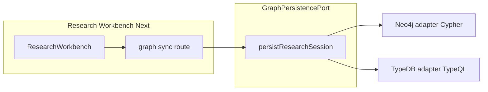

# Graph persistence provider: Neo4j vs TypeDB

## What exists today

**Neo4j (runtime, app path)** — all in the [`product`](d:/Studio13/Lab/Code/GrooveGraph-next/product) workspace:

- **Driver / config:** [`src/lib/server/neo4j-driver.ts`](d:/Studio13/Lab/Code/GrooveGraph-next/product/src/lib/server/neo4j-driver.ts), [`src/lib/server/config.ts`](d:/Studio13/Lab/Code/GrooveGraph-next/product/src/lib/server/config.ts) (`NEO4J_*` env).
- **Persistence:** [`src/lib/server/neo4j-graph-persistence.ts`](d:/Studio13/Lab/Code/GrooveGraph-next/product/src/lib/server/neo4j-graph-persistence.ts) — domain types from [`research-session`](d:/Studio13/Lab/Code/GrooveGraph-next/product/src/types/research-session.ts), but **implementation is Neo4j-specific**: `ManagedTransaction`, `elementId()`, labels `Entity` / `ResearchSession`, rel type `GRAPH_REL`, Cypher `MERGE`/`MATCH`/`CREATE`, merge helpers for JSON attributes.
- **API:** [`app/api/sessions/[sessionId]/neo4j/sync/route.ts`](d:/Studio13/Lab/Code/GrooveGraph-next/product/app/api/sessions/[sessionId]/neo4j/sync/route.ts) calls `persistResearchSessionToNeo4j` only.
- **UI:** [`ResearchWorkbench.tsx`](d:/Studio13/Lab/Code/GrooveGraph-next/product/src/components/ResearchWorkbench.tsx) POSTs to `/api/sessions/.../neo4j/sync`.

**TypeDB (offline / migration, not in the Next app yet)**

- Root [`package.json`](d:/Studio13/Lab/Code/GrooveGraph-next/package.json): `@typedb/driver-http`, `ontology:migrate` → [`ontology/scripts/neo4j-to-typedb-migrate.mjs`](d:/Studio13/Lab/Code/GrooveGraph-next/ontology/scripts/neo4j-to-typedb-migrate.mjs) (batch Neo4j read → TypeDB write).
- [`ontology/README.md`](d:/Studio13/Lab/Code/GrooveGraph-next/ontology/README.md) states **Neo4j is interim**, **TypeDB is the planned primary graph**, canonical model in [`ontology/groovegraph-schema.tql`](d:/Studio13/Lab/Code/GrooveGraph-next/ontology/groovegraph-schema.tql).

**Assumption:** “switch between neo4j and typescript” means **Neo4j and TypeDB**. If you instead meant a **pure TypeScript in-memory / file mock** (no remote graph), the same provider interface applies; the second implementation would be a `MemoryGraphPersistence` used for tests or offline demos.

---

## SWOT: provider model (Neo4j ↔ TypeDB)

**Strengths**

- **Matches your stated architecture:** Ontology already treats Neo4j as a legacy adapter and TypeDB as target; a provider is the natural seam.
- **Single product contract:** Keep [`ResearchSession`](d:/Studio13/Lab/Code/GrooveGraph-next/product/src/types/research-session.ts) + “sync accepted/deferred candidates” as the only inputs; backends implement the same port.
- **Parallel operation:** `GRAPH_BACKEND` (or similar) allows Aura in prod and TypeDB in staging without branching product code.
- **Testability:** Mock or in-memory provider for API/UI tests without live Aura.

**Weaknesses**

- **Not a thin wrapper:** Neo4j uses Cypher + `elementId`; TypeDB 3 uses TypeQL + different identity and typing. You are implementing **two real adapters**, not one query string swap.
- **Result type leakage:** `Neo4jSyncResult`, hints that reference “Neo4j Browser”, and `database` semantics are Neo4j-shaped; neutralizing them is extra work.
- **Dependency layout:** `@typedb/driver-http` lives at **repo root** today; the Research Workbench package would need it (or a shared internal package) for a TypeDB provider.

**Opportunities**

- **One place to map domain → canonical ontology:** Align TypeDB writes with [`groovegraph-schema.tql`](d:/Studio13/Lab/Code/GrooveGraph-next/ontology/groovegraph-schema.tql) instead of only the generated Aura snapshot types.
- **Reuse migration learnings:** [`neo4j-to-typedb-migrate.mjs`](d:/Studio13/Lab/Code/GrooveGraph-next/ontology/scripts/neo4j-to-typedb-migrate.mjs) already shows HTTP driver usage and property mapping patterns—factor shared mapping helpers if both migrator and live writer need the same field names.
- **Gradual URL/API migration:** Introduce `.../graph/sync` while keeping `.../neo4j/sync` as an alias during transition.

**Threats**

- **Schema drift:** If Neo4j labels/properties diverge from TypeQL types, the two providers silently disagree until you add contract tests or a shared mapping spec.
- **Semantics mismatch:** Upsert/idempotency (candidate keys, external IDs) must be re-proven on TypeDB (transactions, uniqueness constraints, how you key `GRAPH_REL`-equivalent relations).
- **Operational risk:** TypeDB client is on an **RC** line (`^3.8.2-rc0`); upgrades may break HTTP API assumptions.
- **Cost of double maintenance:** Until Neo4j is retired, every persistence behavior change may need two implementations unless logic is pushed into shared pure functions (merge rules, filters).

---

## Implementation plan

1. **Define a narrow port (interface + neutral result type)**  
   - Method: `persistResearchSession(session, { includeDeferred })` returning a backend-agnostic shape (e.g. `entitiesUpserted`, `relationshipsUpserted`, `skippedRelationships`, `sessionSnapshot`, optional `hint` without “Neo4j” in field names where possible).  
   - Location: e.g. `src/lib/server/graph-persistence/types.ts` (or under `src/lib/graph/`).

2. **Refactor current code into `Neo4jGraphPersistence`**  
   - Move logic from [`neo4j-graph-persistence.ts`](d:/Studio13/Lab/Code/GrooveGraph-next/product/src/lib/server/neo4j-graph-persistence.ts) behind the port; keep `getNeo4jDriver` / config as Neo4j-only internals.  
   - Export `createNeo4jGraphPersistence()` or equivalent factory.

3. **Add configuration switch**  
   - Extend [`config.ts`](d:/Studio13/Lab/Code/GrooveGraph-next/product/src/lib/server/config.ts) with e.g. `GRAPH_PERSISTENCE_BACKEND=neo4j|typedb` (default `neo4j` for zero surprise).  
   - TypeDB: mirror the env pattern used in [`ontology/scripts/lib/typedb-env.mjs`](d:/Studio13/Lab/Code/GrooveGraph-next/ontology/scripts/lib/typedb-env.mjs) (or import shared parsing if you lift it to a small `packages/` or `ontology/scripts` consumable module—only if duplication hurts).

4. **Implement `TypeDbGraphPersistence`**  
   - Add `@typedb/driver-http` to **product** [`package.json`](d:/Studio13/Lab/Code/GrooveGraph-next/product/package.json) (do not rely only on root hoisting for reproducible builds).  
   - Implement the same **behavioral** contract as Neo4j: filter accepted/deferred, entity upsert keyed by `candidateKeys` / `externalIds` / `nameNorm`+`provisionalKind`, session node, relationship upsert with session-scoped identity.  
   - Map to types/relations in [`groovegraph-schema.tql`](d:/Studio13/Lab/Code/GrooveGraph-next/ontology/groovegraph-schema.tql) (adjust TypeQL if the canonical schema lacks a needed key—prefer schema updates in `ontology/` over ad hoc types).

5. **Wire the API route**  
   - Replace direct `persistResearchSessionToNeo4j` call with `getGraphPersistence().persistResearchSession(...)`.  
   - Optionally add `app/api/sessions/[sessionId]/graph/sync/route.ts` and keep `neo4j/sync` as a thin re-export or 307 for compatibility; update UI `fetch` to `graph/sync` when ready.

6. **Hardening**  
   - Unit tests for shared pure helpers (merge attributes, filters, `candidateKey`).  
   - One integration test per backend behind env (skipped in CI without secrets) or contract test with mocked driver responses.  
   - Document env vars in Research Workbench `.env.example` and cross-link [`ontology/README.md`](d:/Studio13/Lab/Code/GrooveGraph-next/ontology/README.md).

**Out of scope for a first slice (can follow):** read path from graph back into the UI, full query abstraction, or unifying the batch migrator and live writer into one binary—those are larger and not required to **switch write path** by config.
